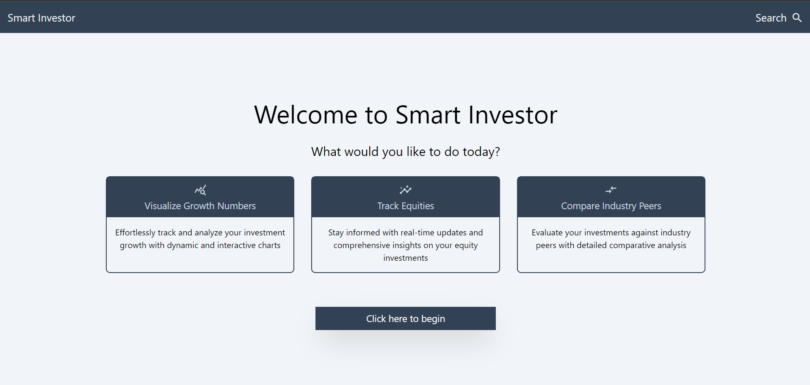
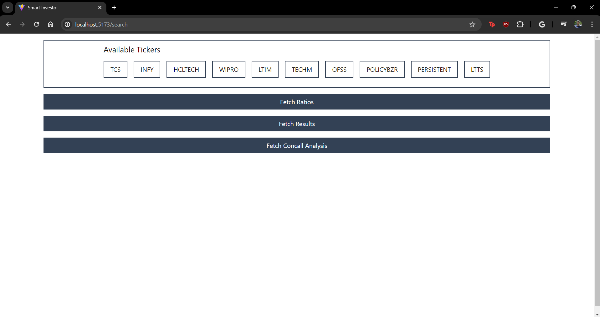
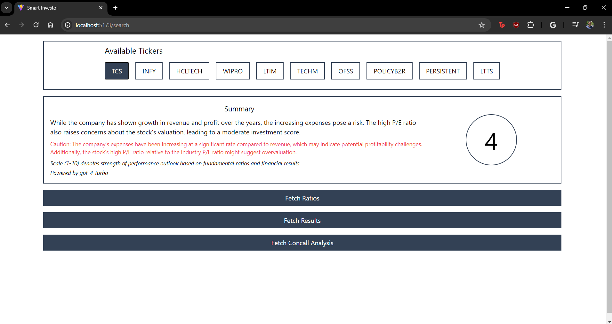
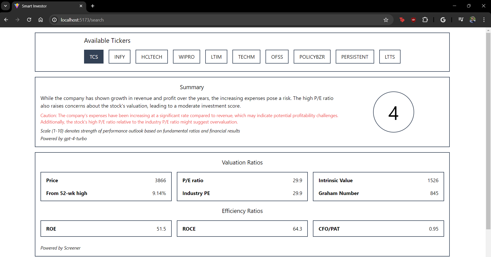
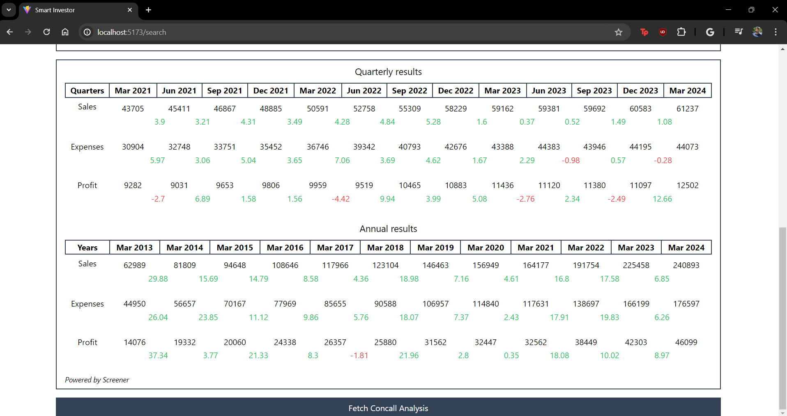
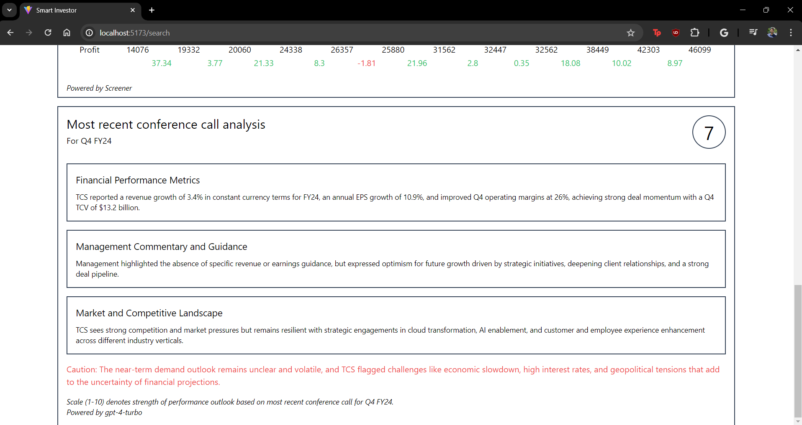

# Smart Investor (React w/ Typescript)

The motivation for this project was to develop a stock
analysis engine that would aggregate data from multiple web
sources and present it in an easy-to-understand way.

## Features

- Track Equities
- Visualize Growth Numbers
- Compare Industry Peers

With intelligent commentary powered by gpt-4

## Installation and Setup

Clone repository from GitHub:

```
  git clone https://github.com/yashdani18/smart_investor_frontend.git
```

Install dependencies:

```
  cd smart_investor_frontend
  npm install
```

## Environment Variables

To run this project, you will need to add the following environment variables to your .env file

`VITE_APP_ENV` (development | production)

`VITE_APP_LOCAL_ROOT_URL`

`VITE_APP_SERVER_ROOT_URL`

## Run Locally

Start the development server:

```bash
  npm run dev
```

## Screenshots

<!--  -->







## 🔗 Links

[](https://www.linkedin.com/in/yashdani27/)

## Acknowledgements

- [Screener - Stock Analysis and Screening Tool](https://www.screener.in/)
- [OpenAI API (model: GPT-4 Turbo)](https://platform.openai.com/docs/models/gpt-4-turbo-and-gpt-4)
